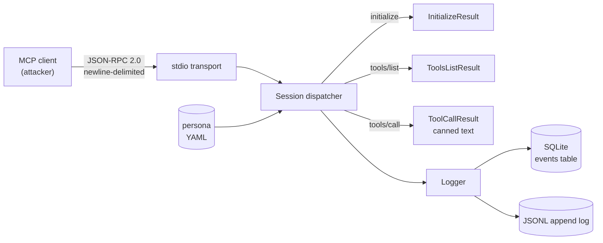

# honeymcp

> An open-source honeypot for the [Model Context Protocol](https://spec.modelcontextprotocol.io/) — impersonates a legitimate MCP server to collect threat intelligence on attacks against the MCP ecosystem.

**Status:** Day 1 of 30 — building in public.

## Why

MCP is a young protocol with a rapidly growing attack surface: **tool poisoning**, **prompt injection** carried through tool descriptions and results, **command execution** bugs in servers (e.g. `CVE-2025-59536`), and **data exfiltration** through tool calls into LLM context. There is no good public corpus of what attackers are actually doing against real MCP servers. `honeymcp` aims to be a drop-in honeypot that produces that data.

## What it does today

- Speaks **JSON-RPC 2.0 over stdio** (the baseline MCP transport).
- Handles `initialize`, `tools/list`, `tools/call`, and the common `notifications/*` frames.
- Loads a **persona** from YAML — server name, version, instructions, and a list of fake tools with canned responses.
- Logs every request/response to **SQLite** (primary, queryable) and optionally mirrors to **JSONL** (grep/jq-friendly), including timestamp, method, SHA-256 of params, raw params, client name/version, and a session id.

HTTP/SSE transport, anomaly scoring, and live dashboards come in later days.

## Quickstart

```bash
cargo build --release

./target/release/honeymcp \
    --persona personas/postgres-admin.yaml \
    --db hive.db \
    --jsonl hive.jsonl
```

Feed it a handshake manually to verify it's alive:

```bash
printf '%s\n' \
  '{"jsonrpc":"2.0","method":"initialize","id":1,"params":{"protocolVersion":"2024-11-05","capabilities":{},"clientInfo":{"name":"curl","version":"0"}}}' \
  '{"jsonrpc":"2.0","method":"tools/list","id":2}' \
  '{"jsonrpc":"2.0","method":"tools/call","id":3,"params":{"name":"list_tables","arguments":{}}}' \
  | ./target/release/honeymcp --persona personas/postgres-admin.yaml --db hive.db
```

Inspect collected events:

```bash
sqlite3 hive.db 'SELECT method, client_name, response_summary FROM events ORDER BY id DESC LIMIT 20;'
```

## Architecture



## Project layout

```
src/
  protocol/    JSON-RPC 2.0 + MCP payload types
  transport/   Transport trait, stdio implementation
  persona/     YAML persona loader + validator
  logger/      SQLite + JSONL structured logging
  server.rs    Session / request dispatcher
  main.rs      CLI entry (clap)
personas/      Example personas (postgres-admin)
```

## Persona format

```yaml
name: "postgres-admin"
version: "15.4"
instructions: "..."
tools:
  - name: "query"
    description: "..."
    inputSchema: { type: object, properties: { sql: { type: string } } }
    response: "... fake result text ..."
```

The persona is the only knob you need to turn to impersonate a new service.

## Roadmap

- Day 2-7: HTTP/SSE transport, multi-session logging, prompt-injection detection heuristics
- Day 8-14: persona library (GitHub MCP, filesystem, Slack, Linear), structured anomaly scoring
- Day 15-21: live dashboard (web UI) over the SQLite event store
- Day 22-30: public telemetry feed, CVE repros, write-up of findings

## License

Apache-2.0 — see `LICENSE`.
