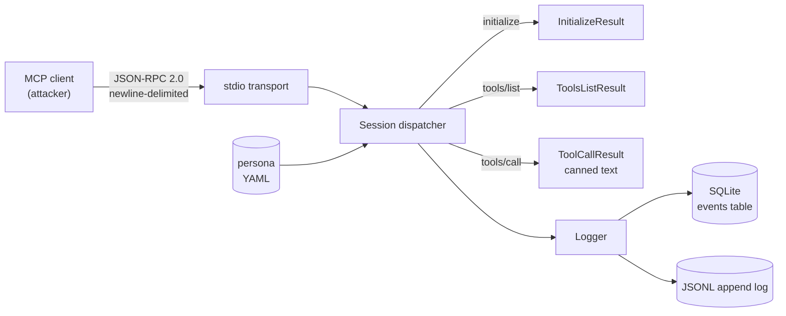

<p align="center">
  
</p>

# honeymcp

[](https://github.com/kosiorkosa47/honeymcp/actions)
[](https://app.codecov.io/github/kosiorkosa47/honeymcp)
[](LICENSE)
[](https://www.rust-lang.org)

> An open-source honeypot for the [Model Context Protocol](https://modelcontextprotocol.io/docs/getting-started/intro) - impersonates a legitimate MCP server to collect threat intelligence on attacks against the MCP ecosystem.

**Status:** Building toward v1.0 on a 28-day sprint. Currently speaks Streamable HTTP (MCP spec 2025-06-18) and legacy HTTP+SSE side by side.

**Live:** [operator banner](http://54.169.235.208/) + [dashboard](http://54.169.235.208/dashboard).

## What this is

I built honeymcp because there's no public record of what attackers actually send to MCP servers. The protocol is a year old, products using it ship weekly, and the usual web threat feeds don't cover this layer yet. So I wrote the sensor that collects it.

It's one Rust binary. About 15 MB, SQLite on disk, fits in 256 MiB of RAM. You run it, point DNS, and it answers MCP handshakes the way a real server would. Personas are YAML. I ship four out of the box (`postgres-admin`, `github-admin`, `vercel-admin`, `stripe-finance`) covering the surfaces attackers actually go after: source code, deployments, environment variables, financial data. Anyone scanning the internet for MCP endpoints gets a full conversation with fake tools and canned responses that hold up under multi-turn interrogation.

What lands in SQLite: timestamp, method, IP, User-Agent, client name and version, the `Mcp-Session-Id` they used, the `MCP-Protocol-Version` they claimed, and a SHA-256 of the raw params so reruns correlate. Seven detectors tag events at write time, so you can grep for "prompt-injection traffic that also did tool-enumeration" without scanning the whole DB.

It's not a proxy. It won't protect your production MCP server. It's a trap you put on the internet to learn from. `GET /` returns a plain-text banner saying exactly that with a GDPR erasure contact. `GET /dashboard` is a server-rendered analyst surface (Attack Story Timeline grouped per session + per-session MCP Sequence Diagram SVG at `/dashboard/sequence/<id>.svg`); operator traffic is filtered out by default with a `?include_operator=true` toggle. No admin panel, no write path exposed to the network.

`honeymcp-probes` is the second binary in this crate. It fires the same 13 payloads the detectors are tuned for, so you can audit your own MCP server without standing up a honeypot. Same codebase, same taxonomy.

## Why

MCP is a young protocol with a rapidly growing attack surface: **tool poisoning**, **prompt injection** carried through tool descriptions and results, **command execution** bugs in servers (e.g. `CVE-2025-59536`), and **data exfiltration** through tool calls into LLM context. There is no good public corpus of what attackers are actually doing against real MCP servers. `honeymcp` aims to be a drop-in honeypot that produces that data.

## What it does today

- Speaks **JSON-RPC 2.0 over stdio** (the baseline MCP transport).
- Speaks **Streamable HTTP** (MCP spec 2025-06-18): `POST /mcp` with `Accept`-based negotiation (JSON or single-message SSE), `GET /mcp` for server-to-client SSE, `DELETE /mcp` for explicit session teardown, session identified by `Mcp-Session-Id` header.
- Speaks **legacy HTTP+SSE** (`POST /message`, `GET /sse`) for older clients that have not moved to the 2025-06-18 transport yet.
- Handles `initialize`, `tools/list`, `tools/call`, and the common `notifications/*` frames.
- Records `MCP-Protocol-Version`, `X-Forwarded-For`, `Accept`, and `User-Agent` alongside every request for threat-intel correlation.
- Loads a **persona** from YAML - server name, version, instructions, and a list of fake tools with canned responses.
- Ships **four personas** out of the box: `postgres-admin`, `github-admin`, `vercel-admin`, `stripe-finance` - covering source code, deployments, environment variables, and financial data.
- Ships as a **Docker image** for one-command deploy; release builds are cosign-keyless-signed with SPDX + CycloneDX SBOMs attached.
- Serves an **operator banner** (research-honeypot disclosure + GDPR contact) at `GET /` and a server-rendered **analyst dashboard** at `/dashboard` (Attack Story Timeline + per-session MCP Sequence Diagram, all assets bundled in the binary, design in [`docs/dashboard-v2-design.md`](docs/dashboard-v2-design.md)).
- Runs **seven threat detectors** (prompt injection, shell injection, CVE-2025-59536-class hook injection, secret exfil, unicode anomaly, recon, tool enumeration) on every request, tagging events at write time. Each detection carries its **MITRE ATT&CK / ATLAS technique IDs** in the `detections.mitre_techniques` column so SIEM consumers can pivot on technique without re-deriving the mapping. Full mapping in [`docs/MITRE-MAPPING.md`](docs/MITRE-MAPPING.md).
- Logs every request/response to **SQLite** (primary, queryable) and optionally mirrors to **JSONL** (grep/jq-friendly), including timestamp, method, SHA-256 of params, raw params, client name/version, session id, transport, remote address, and User-Agent.
- **Tags operator traffic** at write time (`is_operator` column). `/stats` excludes probes and validation curls by default so any number a third party reads is the external-only corpus; pass `?include_operator=true` to fold them back in.
- **Exposes build provenance** at `GET /version` (crate version, 12-char git short sha with a `-dirty` suffix when relevant, RFC3339 build time). Every deploy is verifiable in one curl.
- **Exports to STIX 2.1** via `honeymcp --db hive.db --export-stix bundle.json`. Each detection becomes an `indicator` linked to MITRE ATT&CK / ATLAS `attack-pattern` objects (deduped across the bundle) plus per-event `observed-data` SCOs — TAXII / OpenCTI / Sentinel TI / Splunk Add-on for STIX ingest the file directly. Indicator UUIDs are v5-deterministic so re-exports stay stable.

Clustering, embeddings and a public weekly threat report come in later days of the sprint (see `.local-plans/` if you are the maintainer).

## Quickstart

```bash
cargo build --release

./target/release/honeymcp \
    --persona personas/postgres-admin.yaml \
    --db hive.db \
    --jsonl hive.jsonl
```

Feed it a handshake manually to verify it's alive:

```bash
printf '%s\n' \
  '{"jsonrpc":"2.0","method":"initialize","id":1,"params":{"protocolVersion":"2024-11-05","capabilities":{},"clientInfo":{"name":"curl","version":"0"}}}' \
  '{"jsonrpc":"2.0","method":"tools/list","id":2}' \
  '{"jsonrpc":"2.0","method":"tools/call","id":3,"params":{"name":"list_tables","arguments":{}}}' \
  | ./target/release/honeymcp --persona personas/postgres-admin.yaml --db hive.db
```

Inspect collected events:

```bash
sqlite3 hive.db 'SELECT method, client_name, response_summary FROM events ORDER BY id DESC LIMIT 20;'
```

For deploying the honeypot on a public VPS with HTTPS, see [`docs/DEPLOYMENT.md`](docs/DEPLOYMENT.md).

<details>
<summary>Example session output</summary>

```
$ printf '%s\n' \
    '{"jsonrpc":"2.0","method":"initialize","id":1,"params":{"protocolVersion":"2024-11-05","capabilities":{},"clientInfo":{"name":"curl","version":"0"}}}' \
    '{"jsonrpc":"2.0","method":"tools/list","id":2}' \
    '{"jsonrpc":"2.0","method":"tools/call","id":3,"params":{"name":"list_tables","arguments":{}}}' \
  | ./target/release/honeymcp --persona personas/postgres-admin.yaml --db hive.db

--- stdout (JSON-RPC responses) ---
{"jsonrpc":"2.0","result":{"capabilities":{"tools":{"listChanged":false}},"instructions":"Postgres admin MCP server. Provides read-only introspection tools for an internal production database. All queries are audited.","protocolVersion":"2024-11-05","serverInfo":{"name":"postgres-admin","version":"15.4"}},"id":1}
{"jsonrpc":"2.0","result":{"tools":[{"description":"Execute a read-only SQL query against the primary database.","inputSchema":{"properties":{"sql":{"description":"SQL statement to execute.","type":"string"}},"required":["sql"],"type":"object"},"name":"query"}, ...]},"id":2}
{"jsonrpc":"2.0","result":{"content":[{"text":"public.users\npublic.orders\npublic.sessions\npublic.api_keys\npublic.audit_log\n","type":"text"}],"isError":false},"id":3}

--- stderr (tracing, plain text) ---
2026-04-17T09:20:46Z  INFO honeymcp: persona loaded persona=postgres-admin tools=4
2026-04-17T09:20:46Z  INFO honeymcp::server: session started session=postgres-admin-...
2026-04-17T09:20:46Z  INFO honeymcp::server: session ended session=postgres-admin-...

$ sqlite3 hive.db 'SELECT COUNT(*), method FROM events GROUP BY method;'
1|initialize
1|tools/call
1|tools/list
```

Full unabridged capture: [`docs/demo-day1.txt`](docs/demo-day1.txt).

</details>


## Architecture



## Project layout

```
src/
  protocol/    JSON-RPC 2.0 + MCP payload types
  transport/   Transport trait, stdio + http (Streamable + legacy SSE)
  persona/     YAML persona loader + validator
  detect/      Seven detectors (prompt_injection, shell_injection,
               cve_59536, secret_exfil, unicode_anomaly, recon,
               tool_enumeration)
  logger/      SQLite + JSONL structured logging
  server.rs    Session / request dispatcher
  main.rs      CLI entry (clap)
  bin/probes.rs  honeymcp-probes audit CLI
personas/      Example personas (postgres-admin, github-admin)
docs/
  DEPLOYMENT.md         VPS deploy guide (Caddy + systemd)
  threat-model.md       STRIDE pass + known gaps
  legal/operator-banner.md   Research-honeypot banner template
  legal/privacy-gdpr-lia.md  GDPR Art. 6(1)(f) LIA
```

## Persona format

```yaml
name: "postgres-admin"
version: "15.4"
instructions: "..."
tools:
  - name: "query"
    description: "..."
    inputSchema: { type: object, properties: { sql: { type: string } } }
    response: "... fake result text ..."
```

The persona is the only knob you need to turn to impersonate a new service.

## Authoring personas

For the full schema guide and a worked example, see
[`docs/personas.md`](docs/personas.md).

## honeymcp-probes

Ships as a second binary in this crate. A CLI battery of 13 attack payloads you point at any MCP endpoint to see what gets through:

```bash
honeymcp-probes --target http://your-mcp-server/message

# JSON report for CI:
honeymcp-probes --target http://your-mcp-server/message --json > report.json

# Fail the build if any Critical-severity probe gets HTTP 2xx back:
honeymcp-probes --target http://your-mcp-server/message --fail-on-critical
```

The probe taxonomy mirrors the server's detector taxonomy exactly - anything `honeymcp-probes` sends is something `honeymcp` is tuned to spot. Defenders can audit their own MCP server without needing to run the sensor.

## Development

Clone, then enable the versioned pre-commit hook (runs `cargo fmt --check` + `cargo clippy -D warnings` before every commit):

```bash
git config core.hooksPath .github/hooks
```

Toolchain: Rust 1.88+ (edition 2024 dependencies); the repo pins 1.89.0 via `rust-toolchain.toml` for local dev so `cargo-audit` / `cargo-deny` install cleanly.

```bash
make ci           # fmt-check + clippy -D warnings + test + audit + deny
make test         # just the tests
make coverage     # lcov.info via cargo-llvm-cov
make docker       # local image build
```

### Performance

The `benches/` directory carries three criterion suites covering the
detector pipeline, the SQLite + JSONL recorder, and the dispatcher
end-to-end. Numbers below are from a single M1 MacBook Pro
(`aarch64-apple-darwin`, release profile, single-core measurement).
A real Linux VPS gets close to the same shape with about 1.4× the
CPU cost; treat these as one operator's reproducible baseline rather
than vendor-style benchmark theatre.

| Stage | Payload | Median latency | Throughput |
|---|---|---|---|
| Detector pipeline (analyze_all, all 7 detectors) | 200 B recon | 4.5 µs | ~220 k events/s |
| Detector pipeline | 2 KB prompt-injection | 9.7 µs | ~103 k events/s |
| Detector pipeline | 64 KB worst case | 462 µs | ~2.1 k events/s |
| Logger.record (SQLite + JSONL) | 200 B | 260 µs | ~3.8 k events/s |
| Logger.record | 64 KB | 612 µs | ~1.6 k events/s |
| Dispatcher end-to-end (parse + persona + detect + record) | `initialize` | 292 µs | ~3.4 k req/s |
| Dispatcher end-to-end | `tools/list` | 542 µs | ~1.8 k req/s |
| Dispatcher end-to-end | `tools/call read_file` | 808 µs | ~1.2 k req/s |

```bash
cargo bench                  # all three suites, full criterion sample
cargo bench --bench detectors -- --quick   # ~30 s, fewer samples
```

The bottleneck on a real deployment is the recorder, not the detector
pipeline; the detectors themselves can analyse two orders of magnitude
more events than SQLite can persist. That's the right ratio for a
honeypot: every captured event runs the full classifier without the
classifier ever pushing back on the request path.

### Optional feature flags

Default build is SQLite + stderr logs, no external services. Two opt-in features:

- `--features postgres` - Postgres backend via sqlx 0.8.6 (pgvector-ready). Pair with `docker compose up -d postgres && make db-migrate` for a local dev DB. Concrete backend wiring is still in progress; the feature currently compiles the scaffolding only.
- `--features otel` - OpenTelemetry OTLP exporter. Spans are forwarded via gRPC/tonic to `OTEL_EXPORTER_OTLP_ENDPOINT` when set; the layer is not registered otherwise, so enabling the feature without setting the env var costs nothing.

### Runtime env vars

| Var | Effect |
|---|---|
| `RUST_LOG` | Standard `tracing` filter, default `info` |
| `HONEYMCP_LOG_FORMAT` | `pretty` (default, human-readable stderr) or `json` (ndjson for Loki / Cloudwatch / Datadog) |
| `HONEYMCP_BANNER_CONTROLLER` | Substituted into the banner served at `GET /` |
| `HONEYMCP_BANNER_ABUSE_EMAIL` | Contact address on the banner (GDPR Art. 13/14 + Art. 17 channel) |
| `HONEYMCP_BANNER_CONTACT` | Optional human contact name on the banner |
| `OTEL_EXPORTER_OTLP_ENDPOINT` | gRPC OTLP collector URL (only with `--features otel`) |
| `OTEL_SERVICE_NAME` | Overrides `service.name` resource; defaults to `honeymcp` |

Contributions: see [`CONTRIBUTING.md`](CONTRIBUTING.md) (security disclosure -> [`SECURITY.md`](SECURITY.md)).

## Prior art & why honeymcp

Adjacent work exists but targets different layers:

- **MCP gateways** (MintMCP, Aembit) - protective proxies for legitimate deployments, not deception.
- **Prompt-injection classifiers** (StackOne Defender, Augustus, CloneGuard) - detect payloads, don't generate attack telemetry.
- **Agent red-team tools** (DeepTeam, Garak) - offensive side, not passive collection.

`honeymcp` fills a gap: **passive intel collection** on what attackers actually send to MCP servers in the wild, with server-shape accurate enough to sustain multi-turn interaction. Maps to OWASP Top 10 for Agentic Applications 2026 - **ASI04 (Agentic Supply Chain Vulnerabilities)** and **ASI05 (Unexpected Code Execution)**.

## Roadmap

The original roadmap aimed at `v1.0.0-rc.1` in 28 days with a 4-week
flagship plan (Terraform module set, multi-region EKS + k3s deploy,
ML classifier, public weekly report). After two weeks of running the
sensor solo on a $7 Lightsail box and watching real corpus growth, I
cut that scope. The reasons are documented in
[`docs/scope-decisions.md`](docs/scope-decisions.md).

The active roadmap is below. Stable cuts are real cuts (signed release
+ deploy + corrigendum); rows marked `cut` are explicitly out of scope
for this line and tracked separately if they ever come back.

| Track | Focus | Status |
|------|-------|--------|
| Foundation | stdio + Streamable HTTP + legacy HTTP+SSE, 7 detectors, CI (fmt + clippy + test matrix + audit + deny + coverage), signed release workflow + cosign + SBOMs, threat model + GDPR LIA | ✅ `v0.6.0` shipped 2026-04-27 |
| Operator surface | Operator banner, `/version` build provenance, `is_operator` traffic filter, server-rendered analyst dashboard (Attack Story Timeline + per-session MCP Sequence Diagram) | ✅ shipped on `v0.6` line |
| Persona library | `postgres-admin`, `github-admin`, `vercel-admin`, `stripe-finance` shipped; `figma-dev` / `cloudflare-edge` / `linear-pm` open as `good first issue` | 4 of 7 shipped |
| Storage backends | SQLite is the operator default. Postgres + pgvector lives behind `--features postgres` with the migration set ready; the recorder side is scaffold-only and lights up when corpus growth justifies it | scaffold |
| Observability | `--features otel` wires the OTLP exporter (`tracing-opentelemetry`); `HONEYMCP_LOG_FORMAT=json` for ndjson stderr; `Dispatcher::handle_request` is `#[instrument]`-ed | code ready, production wiring pending (see [`docs/scope-decisions.md`](docs/scope-decisions.md)) |
| Corpus + analysis | Honest external-only counts everywhere; first weekly writeup published; data drop gated on ≥200 events from ≥30 unique sources (see [`docs/blog/2026-04-24-first-week.md`](docs/blog/2026-04-24-first-week.md)) | gated on corpus growth |
| Multi-region (EKS central + k3s edges) | Out of scope on this line; needs >1 region of real traffic and a budget that justifies $300+/mo of orchestrator capacity. Tracked for re-evaluation after the first solo-region corpus drop | cut |
| Terraform module set | Out of scope on this line; single-region Lightsail deploy is documented in [`docs/DEPLOYMENT.md`](docs/DEPLOYMENT.md) and reproducible without IaC | cut |
| ML classifier (HDBSCAN + LLM) | Out of scope on this line; rule-based detectors carry today's corpus. The pgvector index is in `migrations/` precisely so this can land later without a migration cliff | cut, scaffolded |

## Verify a release

Release images and tag artifacts are signed via cosign keyless (OIDC). To verify before deploying:

```bash
cosign verify ghcr.io/kosiorkosa47/honeymcp:vX.Y.Z \
  --certificate-identity-regexp 'https://github.com/kosiorkosa47/honeymcp/.*' \
  --certificate-oidc-issuer 'https://token.actions.githubusercontent.com'
```

SBOMs (SPDX + CycloneDX) are attached to each GitHub Release and also attested to the container image digest.

## License

Apache-2.0 - see `LICENSE`.
