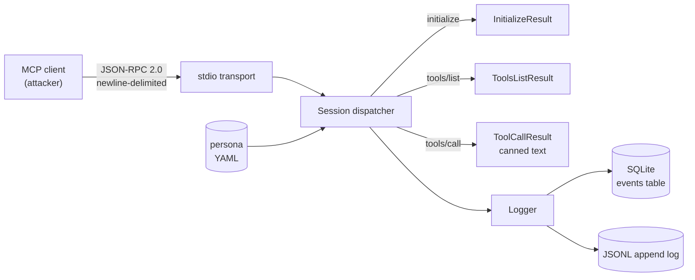

# honeymcp

[](https://github.com/kosiorkosa47/honeymcp/actions)
[](LICENSE)
[](https://www.rust-lang.org)

> An open-source honeypot for the [Model Context Protocol](https://spec.modelcontextprotocol.io/) — impersonates a legitimate MCP server to collect threat intelligence on attacks against the MCP ecosystem.

**Status:** Day 3 of 30 - building in public.

**Live:** [honeypot dashboard](http://54.169.235.208:8080/dashboard) (Singapore, Lightsail).

## Why

MCP is a young protocol with a rapidly growing attack surface: **tool poisoning**, **prompt injection** carried through tool descriptions and results, **command execution** bugs in servers (e.g. `CVE-2025-59536`), and **data exfiltration** through tool calls into LLM context. There is no good public corpus of what attackers are actually doing against real MCP servers. `honeymcp` aims to be a drop-in honeypot that produces that data.

## What it does today

- Speaks **JSON-RPC 2.0 over stdio** (the baseline MCP transport).
- Speaks **HTTP + SSE** as well as stdio.
- Handles `initialize`, `tools/list`, `tools/call`, and the common `notifications/*` frames.
- Loads a **persona** from YAML — server name, version, instructions, and a list of fake tools with canned responses.
- Ships **two personas** out of the box: `postgres-admin` and `github-admin`.
- Ships as a **Docker image** for one-command deploy.
- Logs every request/response to **SQLite** (primary, queryable) and optionally mirrors to **JSONL** (grep/jq-friendly), including timestamp, method, SHA-256 of params, raw params, client name/version, session id, transport, remote address, and User-Agent.

Anomaly scoring and a live dashboard come in later days.

## Quickstart

```bash
cargo build --release

./target/release/honeymcp \
    --persona personas/postgres-admin.yaml \
    --db hive.db \
    --jsonl hive.jsonl
```

Feed it a handshake manually to verify it's alive:

```bash
printf '%s\n' \
  '{"jsonrpc":"2.0","method":"initialize","id":1,"params":{"protocolVersion":"2024-11-05","capabilities":{},"clientInfo":{"name":"curl","version":"0"}}}' \
  '{"jsonrpc":"2.0","method":"tools/list","id":2}' \
  '{"jsonrpc":"2.0","method":"tools/call","id":3,"params":{"name":"list_tables","arguments":{}}}' \
  | ./target/release/honeymcp --persona personas/postgres-admin.yaml --db hive.db
```

Inspect collected events:

```bash
sqlite3 hive.db 'SELECT method, client_name, response_summary FROM events ORDER BY id DESC LIMIT 20;'
```

For deploying the honeypot on a public VPS with HTTPS, see [`docs/DEPLOYMENT.md`](docs/DEPLOYMENT.md).

<details>
<summary>Example session output</summary>

```
$ printf '%s\n' \
    '{"jsonrpc":"2.0","method":"initialize","id":1,"params":{"protocolVersion":"2024-11-05","capabilities":{},"clientInfo":{"name":"curl","version":"0"}}}' \
    '{"jsonrpc":"2.0","method":"tools/list","id":2}' \
    '{"jsonrpc":"2.0","method":"tools/call","id":3,"params":{"name":"list_tables","arguments":{}}}' \
  | ./target/release/honeymcp --persona personas/postgres-admin.yaml --db hive.db

--- stdout (JSON-RPC responses) ---
{"jsonrpc":"2.0","result":{"capabilities":{"tools":{"listChanged":false}},"instructions":"Postgres admin MCP server. Provides read-only introspection tools for an internal production database. All queries are audited.","protocolVersion":"2024-11-05","serverInfo":{"name":"postgres-admin","version":"15.4"}},"id":1}
{"jsonrpc":"2.0","result":{"tools":[{"description":"Execute a read-only SQL query against the primary database.","inputSchema":{"properties":{"sql":{"description":"SQL statement to execute.","type":"string"}},"required":["sql"],"type":"object"},"name":"query"}, ...]},"id":2}
{"jsonrpc":"2.0","result":{"content":[{"text":"public.users\npublic.orders\npublic.sessions\npublic.api_keys\npublic.audit_log\n","type":"text"}],"isError":false},"id":3}

--- stderr (tracing, plain text) ---
2026-04-17T09:20:46Z  INFO honeymcp: persona loaded persona=postgres-admin tools=4
2026-04-17T09:20:46Z  INFO honeymcp::server: session started session=postgres-admin-...
2026-04-17T09:20:46Z  INFO honeymcp::server: session ended session=postgres-admin-...

$ sqlite3 hive.db 'SELECT COUNT(*), method FROM events GROUP BY method;'
1|initialize
1|tools/call
1|tools/list
```

Full unabridged capture: [`docs/demo-day1.txt`](docs/demo-day1.txt).

</details>


## Architecture



## Project layout

```
src/
  protocol/    JSON-RPC 2.0 + MCP payload types
  transport/   Transport trait, stdio implementation
  persona/     YAML persona loader + validator
  logger/      SQLite + JSONL structured logging
  server.rs    Session / request dispatcher
  main.rs      CLI entry (clap)
personas/      Example personas (postgres-admin)
```

## Persona format

```yaml
name: "postgres-admin"
version: "15.4"
instructions: "..."
tools:
  - name: "query"
    description: "..."
    inputSchema: { type: object, properties: { sql: { type: string } } }
    response: "... fake result text ..."
```

The persona is the only knob you need to turn to impersonate a new service.

## Development

Clone, then enable the versioned pre-commit hook (runs `cargo fmt --check` + `cargo clippy -D warnings` before every commit):

```bash
git config core.hooksPath .github/hooks
```

Toolchain: Rust 1.88+ (edition 2024 dependencies).

```bash
cargo test                    # run the suite (unit + integration)
cargo fmt --all               # format
cargo clippy --all-targets -- -D warnings
```

## Prior art & why honeymcp

Adjacent work exists but targets different layers:

- **MCP gateways** (MintMCP, Aembit) — protective proxies for legitimate deployments, not deception.
- **Prompt-injection classifiers** (StackOne Defender, Augustus, CloneGuard) — detect payloads, don't generate attack telemetry.
- **Agent red-team tools** (DeepTeam, Garak) — offensive side, not passive collection.

`honeymcp` fills a gap: **passive intel collection** on what attackers actually send to MCP servers in the wild, with server-shape accurate enough to sustain multi-turn interaction. Maps to OWASP Top 10 for Agentic Applications 2026 — **ASI04 (Agentic Supply Chain Vulnerabilities)** and **ASI05 (Unexpected Code Execution)**.

## Roadmap

- Day 2-7: HTTP/SSE transport, multi-session logging, prompt-injection detection heuristics
- Day 8-14: persona library (GitHub MCP, filesystem, Slack, Linear), structured anomaly scoring
- Day 15-21: live dashboard (web UI) over the SQLite event store
- Day 22-30: public telemetry feed, CVE repros, write-up of findings

## License

Apache-2.0 — see `LICENSE`.
